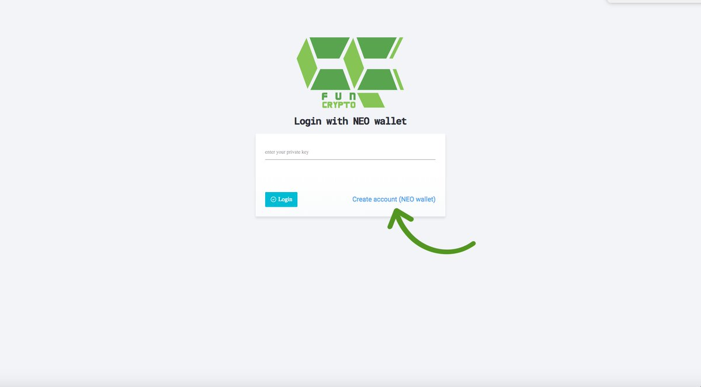
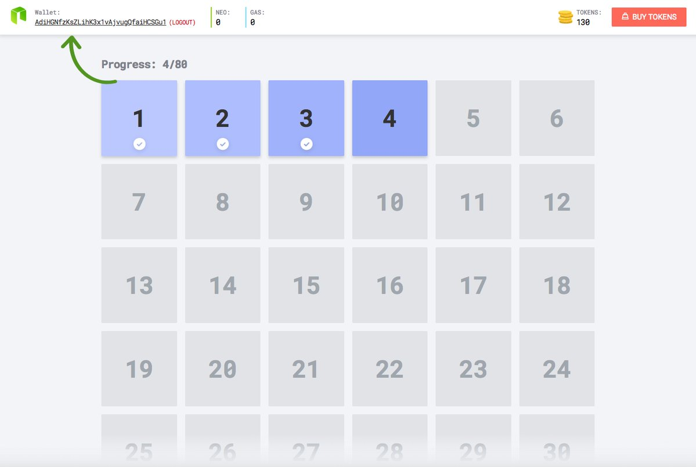
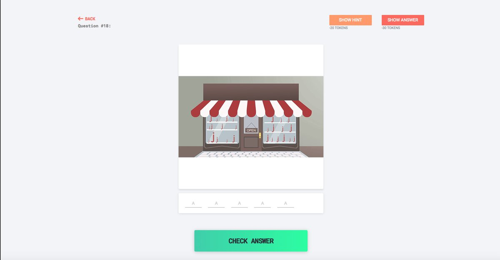
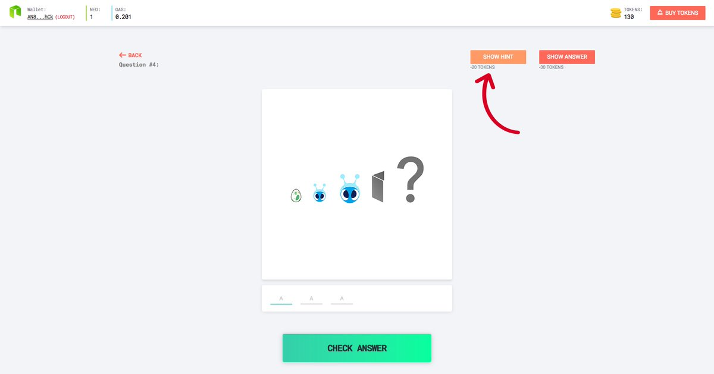
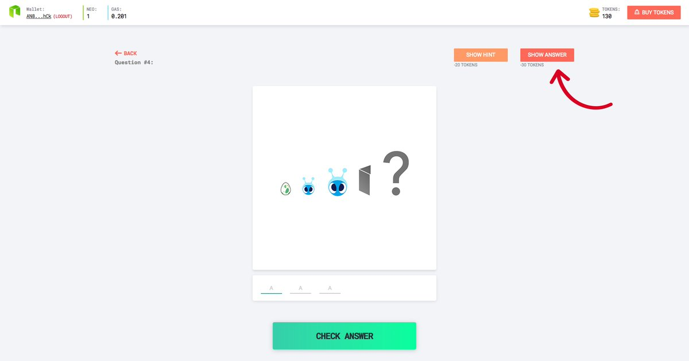
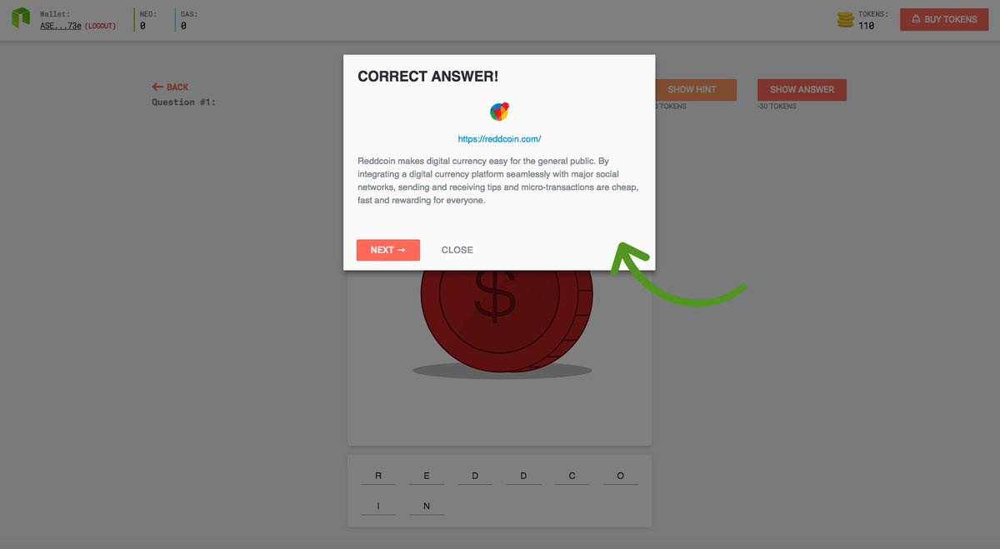
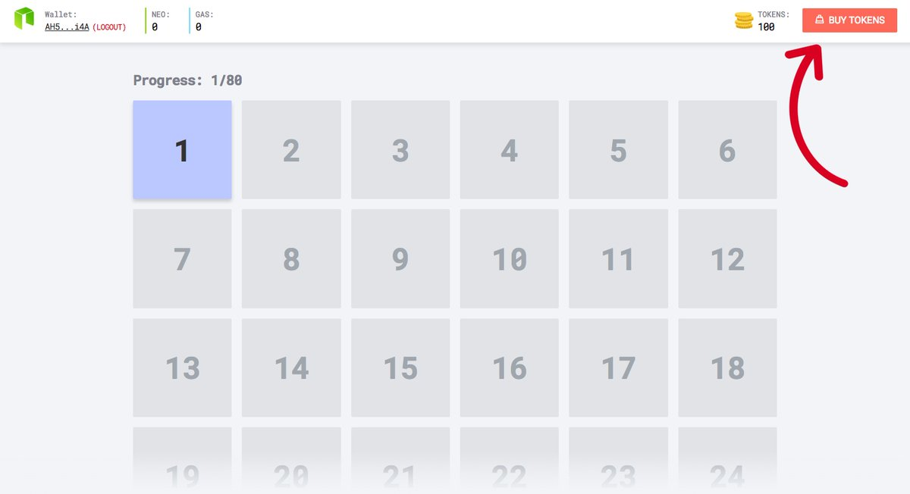
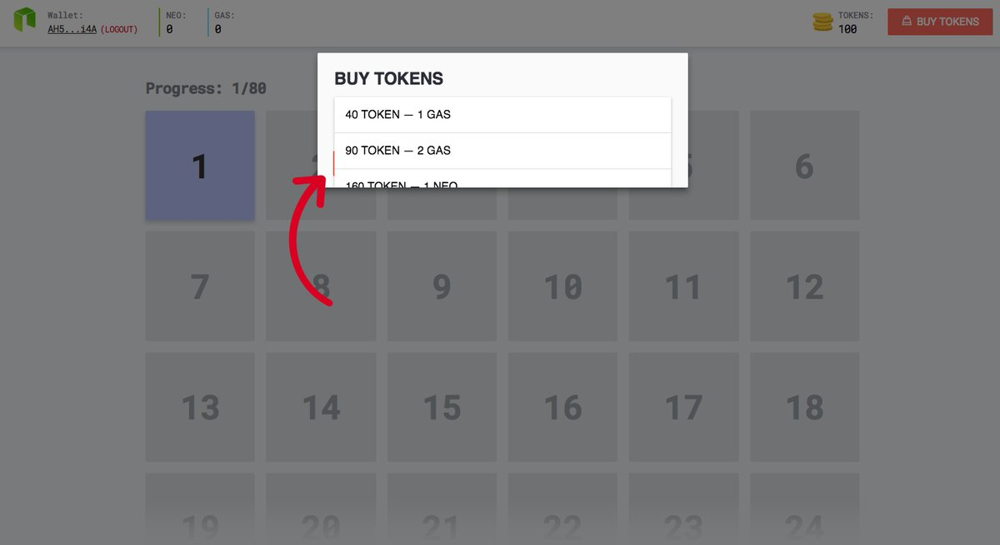

# CRYPTOFUN

**[Cryptofun](https://cryptofun.game/)** allows you to increase and challenge your blockchain knowledge, You have to guess the word correctly at each step using the images. This words can include the name of a coin's, exchanges or expression in cryptos!

---

## Screen Shots:

We suggest you use this section to create a new private key and participate in the game.....It's fast and safe.

---

You can see your Neo address in top right corner.
Your Neo Address is your identity.

---

it is example of level—————> store+j=storj.

---

If you need help, you can press the button and a few letters of the answer will appear to you ( decrease 20 Tokens )

---

If you do not know the answer you can press the show answer button and answer will appear to you ( decrease 30 Tokens )

---

After passing each level, you will see a window containing the response information.

---

If your tokens are zero, you can click on the button in the upper right corner.

---

and select the package you want.

---

This is a successful transaction example.
